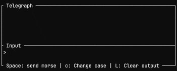

# Telegraph

  

  <!--  -->
  
  

TUI for practicing morse code!

Written in Rust 🦀

Currently only supports straight-key style (`Spacebar`).

## Requirements

⚠️ Requires your terminal emulator to emit keypress-release events. Successfully tested on:
+ [kitty](https://github.com/kovidgoyal/kitty) `>= 0.4.5`
+ [alacritty](https://github.com/alacritty/alacritty) `>= 0.16.1`
